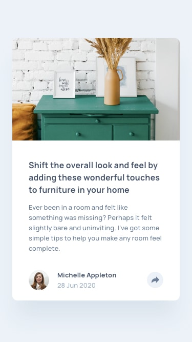

# Frontend Mentor – Article Preview Component

This project is a responsive article preview component built as part of a Frontend Mentor challenge.

The goal was to create a clean, interactive UI component with a focus on layout, responsiveness, and user interaction.

---

## 🔗 Live Demo

👉 [Live Site URL](https://your-live-site-url.com)

---

## 📸 Preview

**Mobile View**  


**Desktop View**  


---

## 📌 Project Description

This project displays an article preview card that includes an image, title, description, and user information.

A key feature of this component is the interactive **share button**, which reveals a social media tooltip or bar depending on the screen size.

The layout adapts between mobile and desktop views, ensuring both usability and visual consistency.

---

## 🎯 Features

- Responsive design for mobile and desktop
- Interactive share button with toggle behavior
- Tooltip-style social icons on desktop
- Full-width social bar on mobile
- Click-outside detection to close tooltip
- Clean and minimal UI design

---

## 🧠 Focus Areas

- Responsive UI behavior
- Event handling in JavaScript
- Tooltip positioning and layering
- State management with class toggling
- Mobile vs desktop interaction differences

---

## 🧰 Built With

- HTML5
- CSS3 (Flexbox)
- Vanilla JavaScript
- Responsive design principles
- Custom CSS variables

---

## 🚀 Setup

```bash
git clone https://github.com/Hajimee1/Article-Preview-Component.git
cd Article-Preview-Component
```
